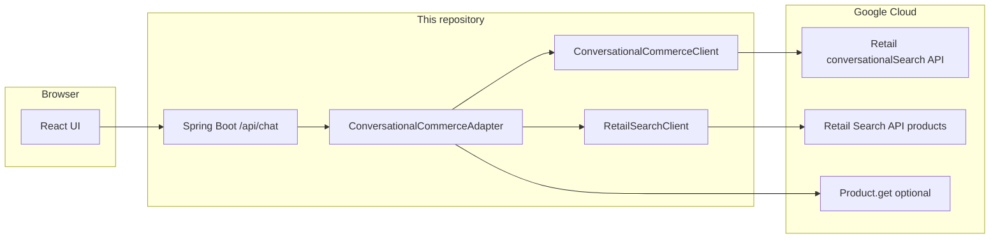

# System overview

## What this application is

A **chat web app** (React + Spring Boot) that talks to **Google Cloud Retail / Vertex AI Search for commerce**: conversational search for intent and follow-ups, plus **Retail Search** for product results. Optional **Gemini** usage supports clarifying copy and the **ADK** orchestration mode.

## Layers

- **Frontend** (`frontend/`): `ChatInterface`, `useChat`, `POST /api/chat` (often via Vite proxy to `/api`).
- **Backend** (`backend/`): `ChatController` → `OrchestratorService` → mode-specific orchestrator → `ConversationalCommerceAdapter` (for conversational commerce) or ADK runner (for Approach B).
- **GCP**: Catalog and search configuration live in your project (placement, branch). The app does not ship a product database; it calls Retail APIs using service account credentials.

## Configuration at a glance

Placement, branch, project, transport (`rest` vs `grpc`), and credentials are described in **[CONFIG.md](../CONFIG.md)**. The same Retail **placement** is used for both conversational search and product search in the default adapter flow.

## Deeper reading

- **[product-search-and-retail-apis.md](product-search-and-retail-apis.md)** — the two-step GCP pattern (this is the detail behind “separate Retail Search call”).
- **[orchestration-and-modes.md](orchestration-and-modes.md)** — how `mode` changes routing.
- **[frontend-and-chat-api.md](frontend-and-chat-api.md)** — what the UI sends on each turn.
